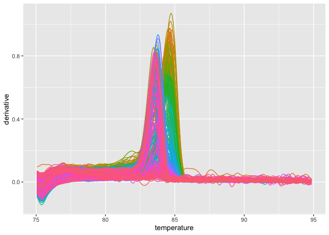
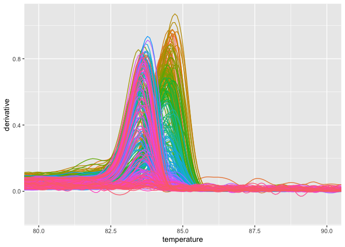
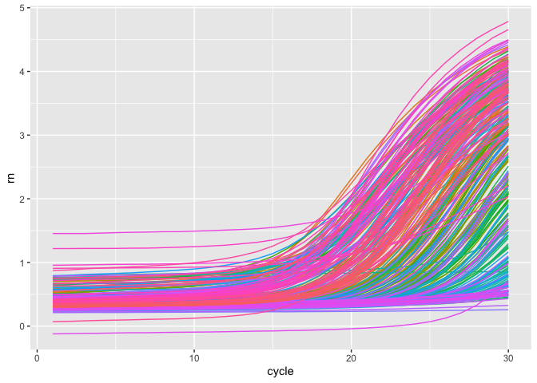
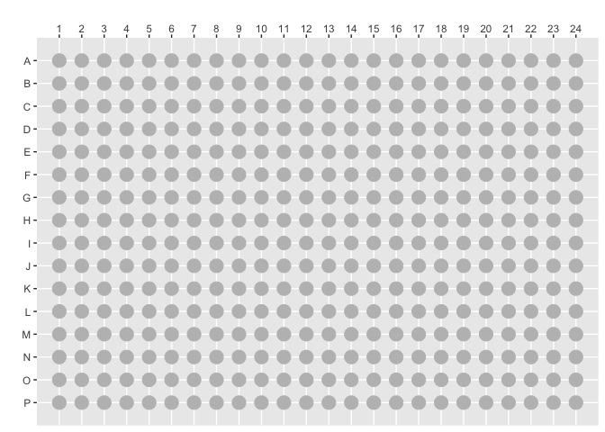
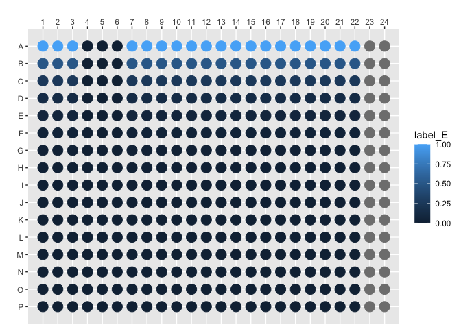
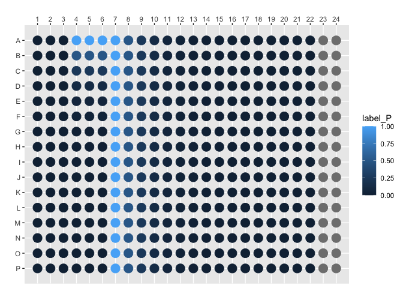
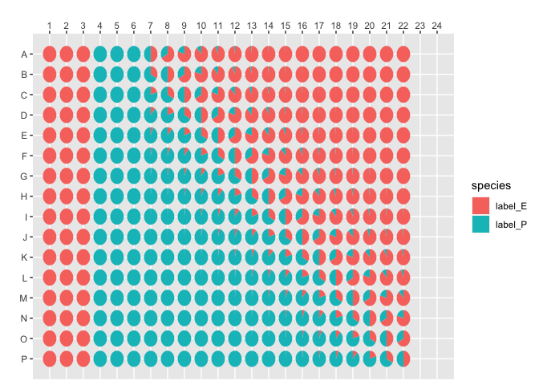
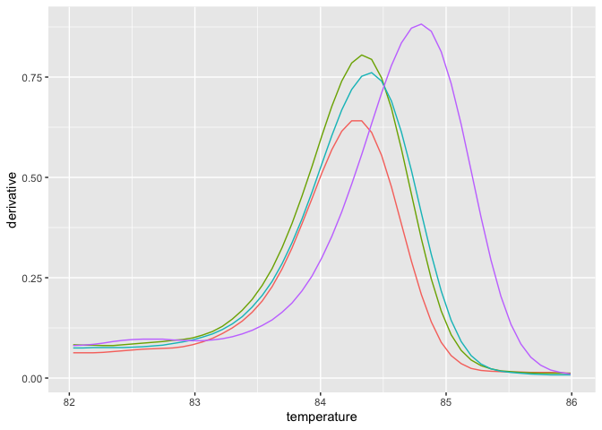
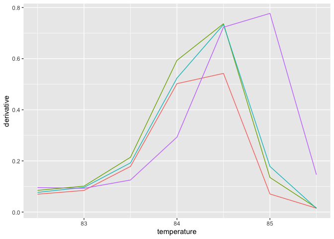
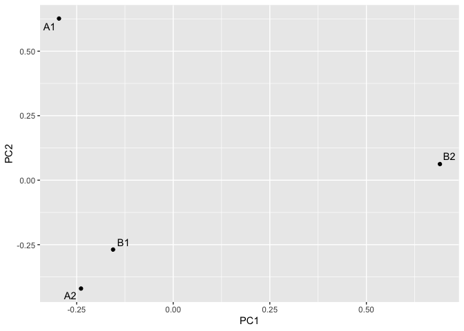

<!-- README.md is generated from README.Rmd. Please edit that file -->

# mcmodel

<!-- badges: start -->

[](https://github.com/gaospecial/mcmodel)
<!-- badges: end -->

The goal of `mcmodel` is to standardize the method for melting curve
data modelling and prediction.

## Installation

You can install the development version of mcmodel from
[GitHub](https://github.com/) with:

``` r
# install.packages("devtools")
devtools::install_github("gaospecial/mcmodel")
```

``` r
library(mcmodel)
library(dplyr)
#> 
#> Attaching package: 'dplyr'
#> The following objects are masked from 'package:stats':
#> 
#>     filter, lag
#> The following objects are masked from 'package:base':
#> 
#>     intersect, setdiff, setequal, union
library(readr)
library(ggplot2)
```

## 读取熔解曲线数据

``` r
# sample data
file = system.file("quantstudio", "quantstudio-export.txt.gz", package = 'mcmodel')
all_data = read_quantstudio(file)
```

`all_data` contains all information in that file, including experimental
setting, melting curve data, and so on.

``` r
all_data
#> An object of class 'QuantStudioRaw':
#>    Slots: [Sample Setup], [Raw Data], [Amplification Data], [Multicomponent Data], [Results], [Reagent Information], [Melt Curve Raw Data], Meta;
```

We use `get_quantstudio_melting_curve()` to get melting curve dataset.

``` r
melting_curve_data = get_quantstudio_melting_curve(all_data)
melting_curve_data
#> # A tibble: 88,854 × 6
#>    well  well_position reading temperature fluorescence derivative
#>    <chr> <chr>           <dbl>       <dbl>        <dbl>      <dbl>
#>  1 1     A1                  1        75.1         1.60      0.043
#>  2 1     A1                  2        75.1         1.60      0.037
#>  3 1     A1                  3        75.2         1.60      0.032
#>  4 1     A1                  4        75.3         1.61      0.029
#>  5 1     A1                  5        75.4         1.61      0.027
#>  6 1     A1                  6        75.5         1.60      0.028
#>  7 1     A1                  7        75.5         1.60      0.031
#>  8 1     A1                  8        75.6         1.59      0.036
#>  9 1     A1                  9        75.7         1.59      0.041
#> 10 1     A1                 10        75.8         1.59      0.046
#> # ℹ 88,844 more rows
```

In this experiment, these are \> 81k observations of six variables.

## 绘制熔解曲线

If you want to plot the melting curve, just use the
`plot_quantstudio_melting_curve()`.

``` r
plot_quantstudio_melting_curve(melting_curve_data)
```


Type `?plot_quantstudio_melting_curve` in your console, and you may find
that there is a extra argument for this function.

``` r
plot_quantstudio_melting_curve(melting_curve_data, y = "derivative")
```



If you want to scale up this plot,

``` r
plot_quantstudio_melting_curve(melting_curve_data, y = "derivative") +
  coord_cartesian(xlim = c(80, 90))
```



Likewise, you may get the amplification data, and plot it.

``` r
amplification_data = get_quantstudio_amplication(all_data)
plot_quantstudio_amplification_curve(amplification_data)
#> Warning: Removed 900 rows containing missing values (`geom_line()`).
```



This is just a small step to proceed this program, and it is the way
what I want.

### Plot Community Structure in 384-well Plate

空白的平板，这样画：

``` r
plot_384() +
  geom_point(color = "grey", size = 5)
```



画单一物种的数量。首先画大肠杆菌的含量（log2）。

Plate.

``` r
file =  system.file("quantstudio", "quantstudio-plate.csv.gz", package = 'mcmodel')
concentration = read_csv(file)
#> Rows: 352 Columns: 3
#> ── Column specification ────────────────────────────────────────────────────────
#> Delimiter: ","
#> chr (1): well_position
#> dbl (2): label_E, label_P
#> 
#> ℹ Use `spec()` to retrieve the full column specification for this data.
#> ℹ Specify the column types or set `show_col_types = FALSE` to quiet this message.
concentration
#> # A tibble: 352 × 3
#>    well_position label_E label_P
#>    <chr>           <dbl>   <dbl>
#>  1 A1                  1   0    
#>  2 A2                  1   0    
#>  3 A3                  1   0    
#>  4 A4                  0   1    
#>  5 A5                  0   1    
#>  6 A6                  0   1    
#>  7 A7                  1   1    
#>  8 A8                  1   0.5  
#>  9 A9                  1   0.25 
#> 10 A10                 1   0.125
#> # ℹ 342 more rows
```

``` r
plot_384_single_concentration(concentration, species = "label_E")
```



其次，用另外一个颜色画假单胞菌的含量。

``` r
plot_384_single_concentration(concentration, species = "label_P")
```



画每个孔的结构。

``` r
plot_384_community_structure(concentration)
```



## 使用 MeltingCurve 对象

使用 `MeltingCurve` 对象可以确保数据不会被意外修改。

**创建 MC 对象**

从实验原始数据创建 MC 对象。

``` r
all_data
#> An object of class 'QuantStudioRaw':
#>    Slots: [Sample Setup], [Raw Data], [Amplification Data], [Multicomponent Data], [Results], [Reagent Information], [Melt Curve Raw Data], Meta;
mc = quantstudio2mc(all_data)
```

画熔解曲线。

``` r
plot_mc(mc, show_tm = FALSE)
```


过滤熔解曲线的温度范围，以及反应孔。

``` r
mc_narrow = filterData(mc, 82, 86, c("A1","A2","B1","B2"))
plot_mc(mc_narrow, show_tm = FALSE)
```



对熔解曲线进行重采样。

``` r
mc_low = transformData(mc_narrow, step = 0.5)
plot_mc(mc_low)
```



将对象转变成建模数据集。

``` r
df = mc_tbl2wider(mc_low)
df
#> # A tibble: 4 × 8
#>   well_position  T82.5    T83 T83.5   T84 T84.5    T85  T85.5
#>   <chr>          <dbl>  <dbl> <dbl> <dbl> <dbl>  <dbl>  <dbl>
#> 1 A1            0.0698 0.0845 0.179 0.502 0.542 0.0707 0.0151
#> 2 A2            0.0849 0.101  0.214 0.593 0.737 0.135  0.0163
#> 3 B1            0.0769 0.0965 0.192 0.524 0.733 0.178  0.0145
#> 4 B2            0.0959 0.0928 0.125 0.293 0.723 0.777  0.146
```

主成分分析。

``` r
pca = mc_pca(mc_low)
mc_pca_plot(pca)
#> Warning: Duplicated aesthetics after name standardisation: NA
```


